# Funcionamiento en Diagramas

Versión gráfica y resumida del firmware `v2.3.0`. La explicación detallada de cada bloque está en
[`EXPLICACION_CODIGO.md`](../EXPLICACION_CODIGO.md).

> Los diagramas están en Mermaid: GitHub los dibuja automáticamente. En VS Code se ven con la extensión
> *Markdown Preview Mermaid Support*.

---

## 1. El sistema completo

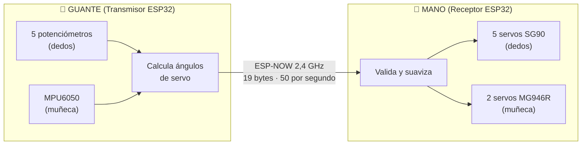

**Idea clave:** el guante hace todas las cuentas y manda los ángulos finales. La mano sólo valida,
suaviza y mueve.

---

## 2. Qué viaja por el aire

Un paquete de **19 bytes**, 50 veces por segundo:

```
┌────────┬─────┬─────┬─────┬─────┬─────┬─────┬──────────┬──────────┬──────────┐
│ 0xAA55 │ Sec │ Pul │ Índ │ Med │ Anu │ Meñ │ Muñeca V │ Muñeca R │ Checksum │
│ 2 B    │ 1 B │ 2 B │ 2 B │ 2 B │ 2 B │ 2 B │ 2 B      │ 2 B      │ 2 B      │
└────────┴─────┴─────┴─────┴─────┴─────┴─────┴──────────┴──────────┴──────────┘
  firma   n.º    25° = abierto … 90° = cerrado   25..90°    0..180°   Fletcher-16
```

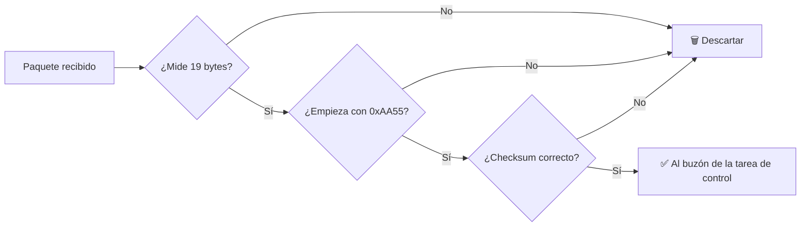

---

## 3. El guante: un ciclo cada 20 ms

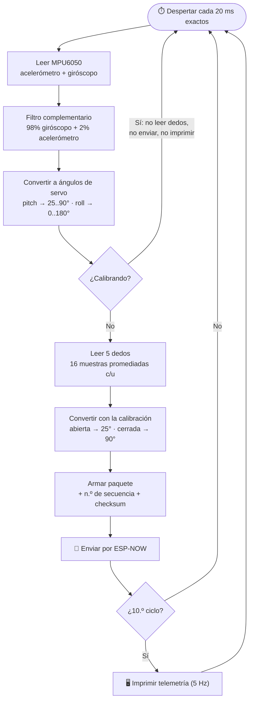

### Cómo se obtiene cada dedo

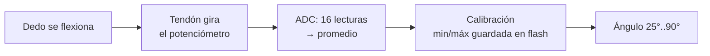

### Cómo se obtiene la muñeca

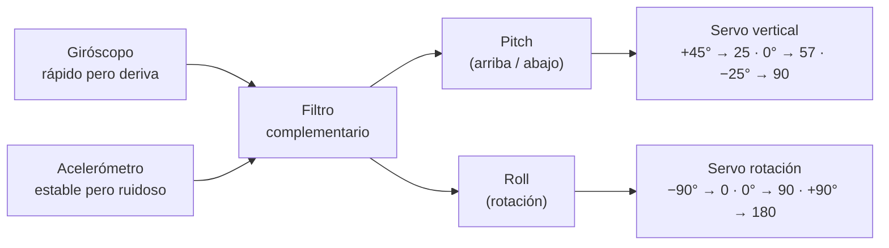

---

## 4. La mano: del paquete al servo

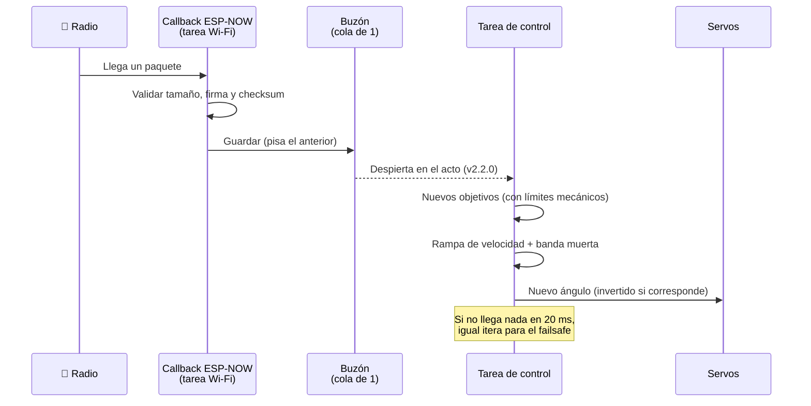

### Cómo se mueve cada servo en cada ciclo

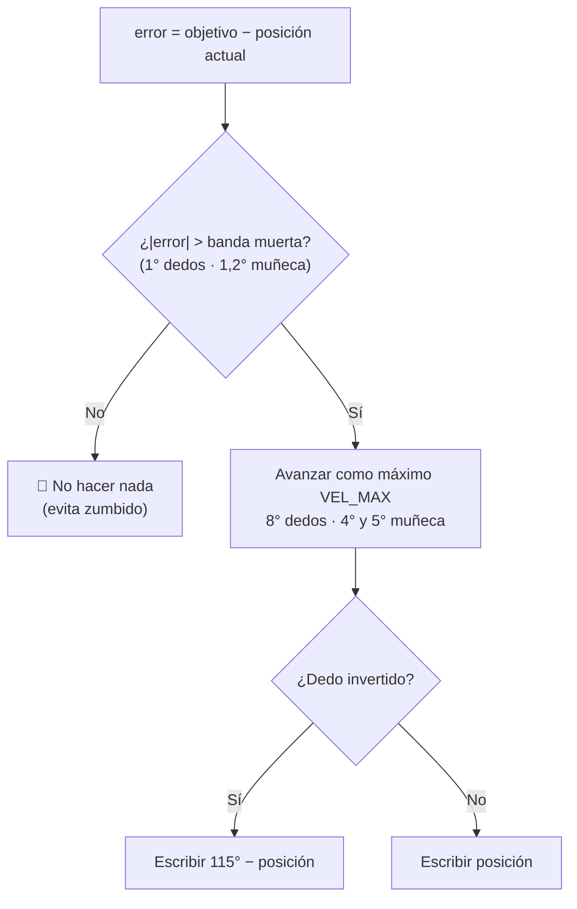

---

## 5. Seguridad: máquina de estados del receptor

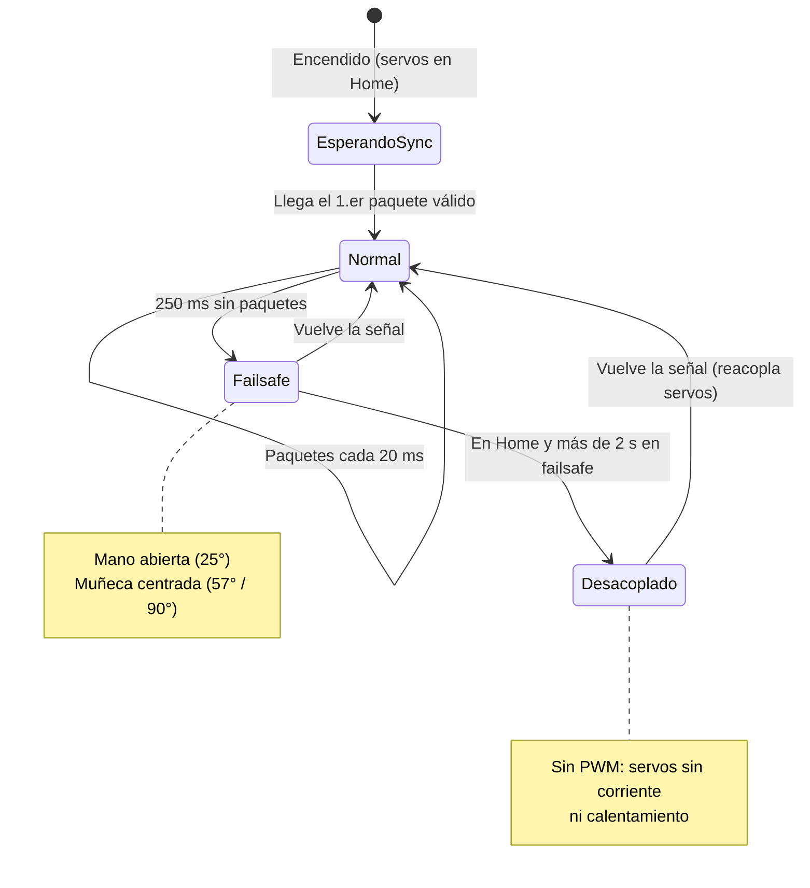

> "Desacoplado" no es un estado del código: es el failsafe con los servos apagados (`detach`).
> Se dibuja aparte para que se entienda qué pasa.

---

## 6. Calibración de los dedos

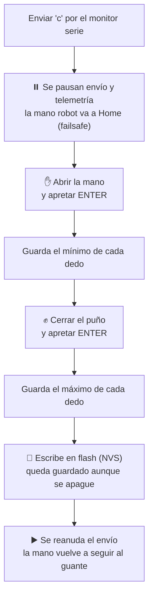

La muñeca se calibra sola al encender el guante: **hay que mantener la mano quieta ~1,5 s.**

---

## 7. ¿Cuánto tarda? (estimado, v2.2.0)

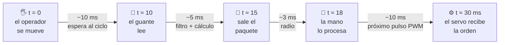

≈ **30 ms** de media hasta la orden, más lo que tarda el servo en recorrer el ángulo.
Son estimaciones a partir del código, no mediciones.

---

## 8. Historia de versiones

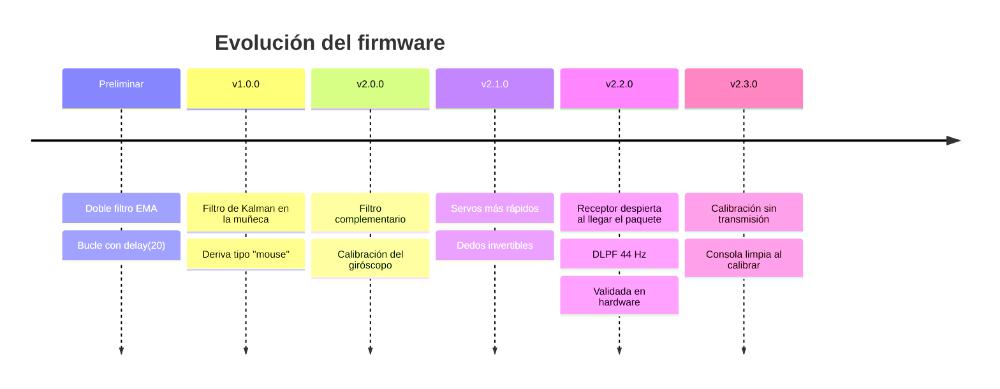

---

## 9. ¿Qué tocar si…?

| Si pasa esto… | …tocar esto | En |
|---|---|---|
| 🔄 Un dedo va al revés | `INVERTIR_DEDO` | Mano |
| ✋ Un dedo no abre/cierra del todo | Recalibrar con `c` | Guante |
| 💥 Movimientos bruscos o reinicios | Bajar `VEL_MAX_*` | Mano |
| 🐢 Movimientos lentos | Subir `VEL_MAX_*` | Mano |
| 🐝 Servos zumban quietos | Subir `DEADBAND_*` | Mano |
| 📐 Muñeca no centrada | `TRIM_PITCH_DEG` / `TRIM_ROLL_DEG` | Guante |
| 📶 `RF:NO_ACK` | Revisar `macReceptor[]` | Guante |
